# Lab 01 - Data Sources & Datasets

## Overview

In this lab, you’ll use Power BI Report Builder to connect to a Power BI semantic model (dataset) that’s built from a CSV exported from FPDS. You’ll create a shared data source, build multiple datasets (including parameterized and lookup datasets), then do a quick layout smoke test by adding a table and a matrix with no formatting.

## Learning objectives

By the end, you can:

- Explain the difference between Data Source and Dataset in paginated reports.
- Connect a paginated report to a Power BI dataset.
- Build summary and detail datasets, plus lookup datasets for parameters.
- Add parameters and wire them to datasets.
- Validate the datasets end‑to‑end with a simple table and matrix.

## What you need

- Power BI Desktop (latest)
- Power BI Report Builder (latest)
- A Power BI workspace you can publish to
- File: Tetra Tech - Search Results.csv

## Part 1 - Build the semantic model in Power BI Desktop

### 1.1 Import the CSV

- Open Power BI Desktop
- Create a blank report → Get data → Text/CSV → choose Tetra Tech - Search Results.csv → Transform Data
- Remove all columns except for:
  - Contract ID
  - Action Obligation ($)
  - Date Signed
  - PSC Description
  - NAICS Description
  - Entity State
  - Legal Business Name
- Rename Action Obligation ($) to Action Obligation
- Verify that data type for Action Obligation is set to Fixed decimal number
- Verify that data type for Date Signed is set to Date
- Data types for all other columns should be Text
- Add Year Signed:
  - Select Date Signed
  - Add Column → Date → Year
  - Rename to Year Signed
- Click Close & Apply

### 1.2 Create a basic measure

Click Modeling → New measure and use the following DAX definition:

```DAX
Total Action Obligation = SUM('Tetra Tech - Search Results'[Action Obligation])
```

### 1.3 Publish the model

- File → Save (e.g., FPDS_TetraTech.pbix)
- Home → Publish → login to the Power BI Service (if required)
- Create a new workspace (in Power BI Service) or select an existing workspace with access
- Confirm in the Power BI Service that the semantic model is present

### 1.4 Save the report

- Save the report as an .rdl file

## Part 2 - Connect Report Builder to the Power BI semantic model

### 2.1 Create the shared Data Source

- Open Power BI Report Builder and choose Blank Report
- In the Report Data pane, right‑click Data Sources and choose Add Power BI semantic model connection...; sign in if prompted
- Select your workspace, select the dataset/semantic model you published, and click Select


- Optional: rename the data source

### 2.2 Create a summary Dataset (by NAICS)

- In the Report Data pane, right‑click Datasets, and click Add Dataset
- Name the dataset something like ds_SummaryByNAICS
- Choose your data source from the dropdown and click Query Designer
- Drag the NAICS Description field and the Total Action Obligation measure into the dataset definition
- Execute the query to verify results

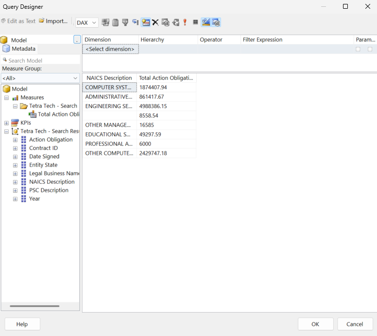

- Click OK
- In the resulting Query, add ```ORDER BY 'Tetra Tech - Search Results'[NAICS Description]``` to the end of the query
- Click Validate Query (to confirm no errors)

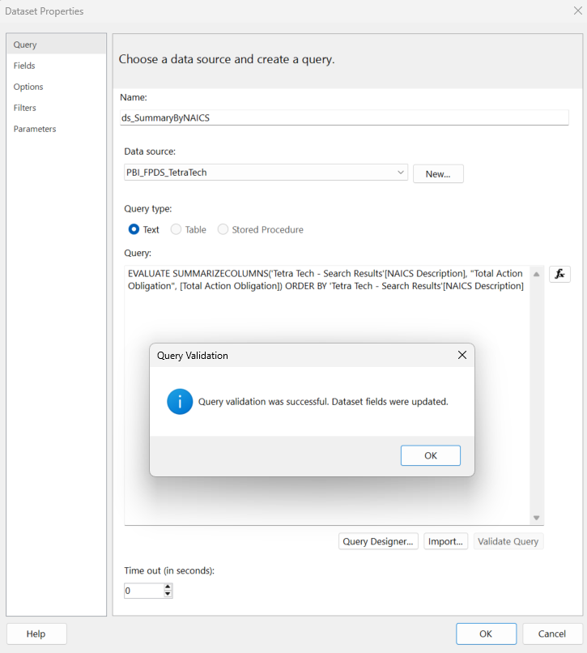

- Click OK and OK

### 2.3 Create lookup Datasets for parameter dropdowns

- In the Report Data pane, right‑click Datasets, and click Add Dataset
- Name the dataset something like ds_States
- Choose your data source from the dropdown
- For Query, use the following:

```DAX
EVALUATE SUMMARIZECOLUMNS('Tetra Tech - Search Results'[Entity State]) ORDER BY 'Tetra Tech - Search Results'[Entity State]
```

- Navigate to Fields and verify all field names

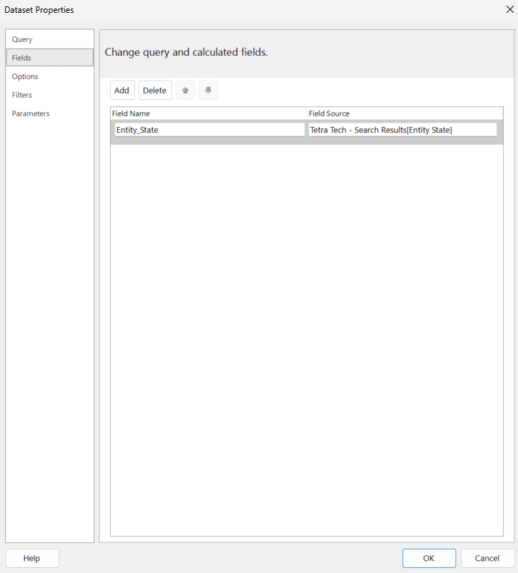

- Click Query and click Validate Query (to confirm no errors)

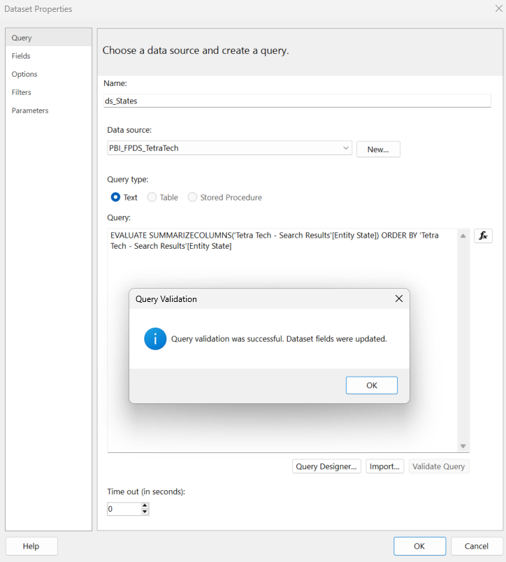

- Click OK and OK
- In the Report Data pane, right‑click Datasets, and click Add Dataset
- Name the dataset something like ds_NAICS
- Choose your data source from the dropdown
- For Query, use the following:

```DAX
EVALUATE SUMMARIZECOLUMNS('Tetra Tech - Search Results'[NAICS Description]) ORDER BY 'Tetra Tech - Search Results'[NAICS Description]
```

- Navigate to Fields and verify all field names

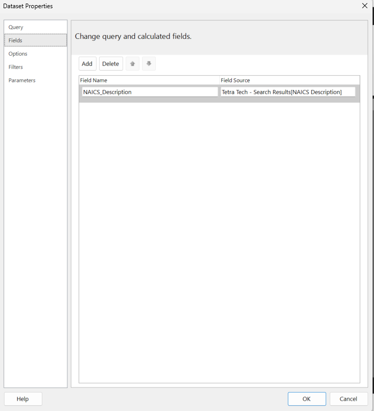

- Click Query and click Validate Query (to confirm no errors)

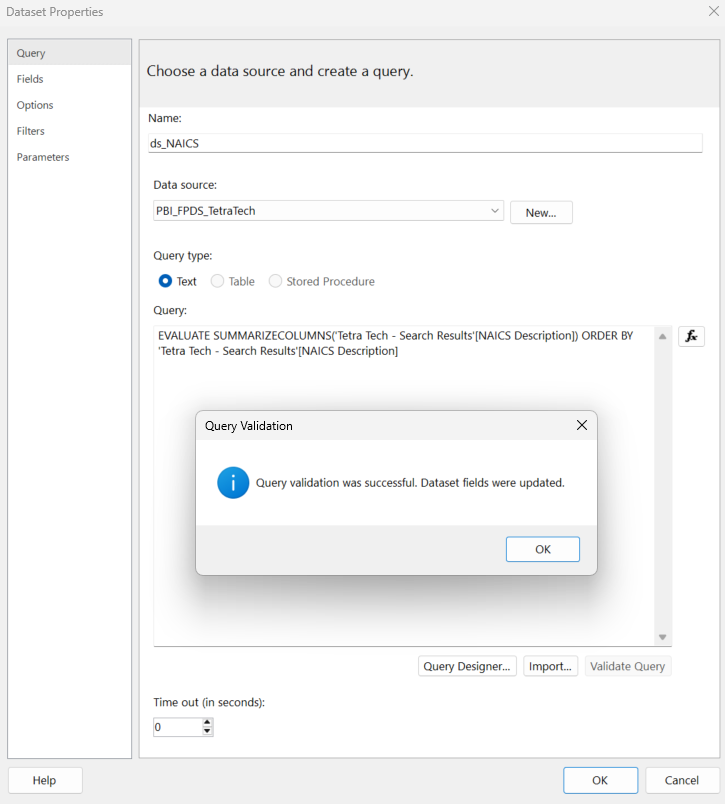

- Click OK and OK

### 2.4 Create parameters for State and NAICS

- In the Report Data pane, right-click Parameters, and click Add Parameter...
- On the General tab, for Name use State and for Prompt use Selected State(s)

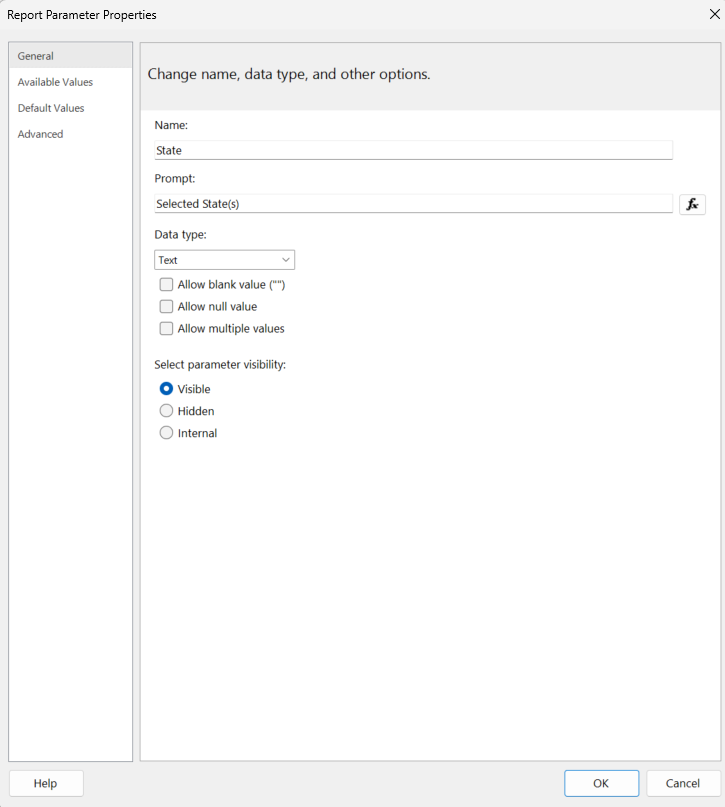

- On the Available Values tab, set the following:

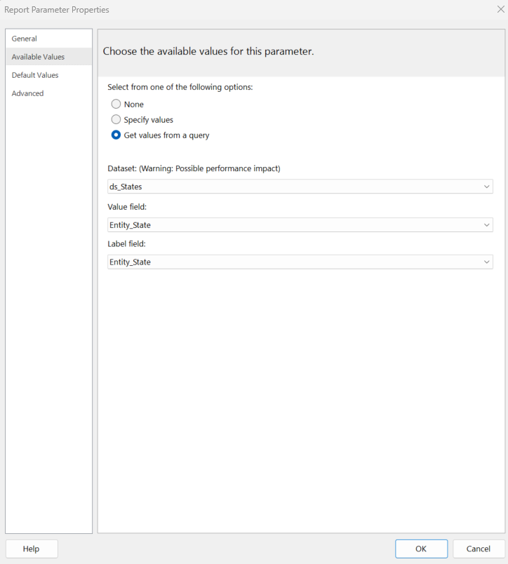

- Click OK
- In the Report Data pane, right-click Parameters, and click Add Parameter...
- On the General tab, for Name use NAICS and for Prompt use Selected NAICS
- Check Allow blank value (""):

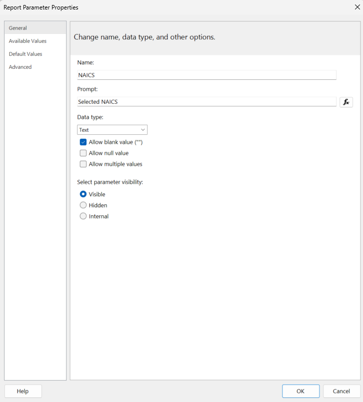

- On the Available Values tab, set the following:

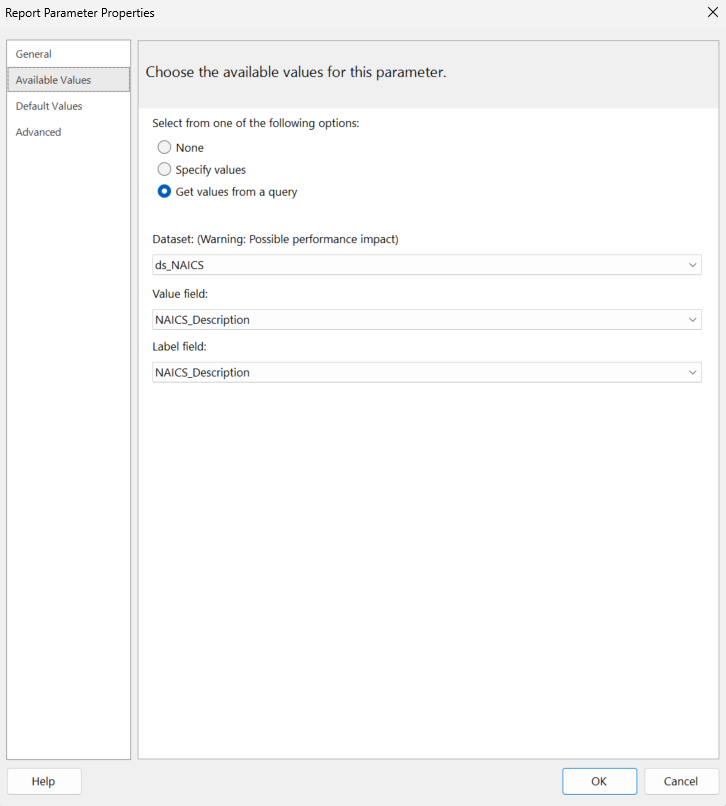

- Click OK

### 2.5 Create a parameterized detail Dataset

- In the Report Data pane, right‑click Datasets, and click Add Dataset
- Name the dataset something like ds_Details
- Choose your data source from the dropdown
- For Query, use the following:

```DAX
EVALUATE SUMMARIZECOLUMNS('Tetra Tech - Search Results'[Contract ID], 'Tetra Tech - Search Results'[Date Signed], 'Tetra Tech - Search Results'[Legal Business Name], 'Tetra Tech - Search Results'[NAICS Description], 'Tetra Tech - Search Results'[PSC Description], 'Tetra Tech - Search Results'[Entity State], 'Tetra Tech - Search Results'[Action Obligation])
```

- Navigate to Fields and verify all field names


- Click Filters and specify the following filters:


- Click Query
- In the resulting Query, add ```ORDER BY 'Tetra Tech - Search Results'[Date Signed]``` to the end of the query
- Click Validate Query (to confirm no errors)


- Click OK and OK

### 2.6 Add a second summary Dataset for a matrix

- In the Report Data pane, right‑click Datasets, and click Add Dataset
- Name the dataset something like ds_SummaryByNAICSYear
- Choose your data source from the dropdown and click Query Designer
- Drag the NAICS Description field, the Year field, and the Total Action Obligation measure into the dataset definition
- Execute the query to verify results

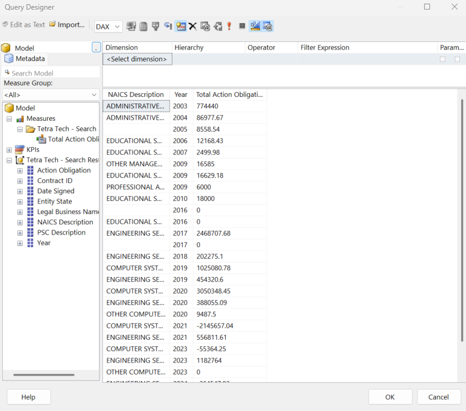

- Click OK
- In the resulting Query, add ```ORDER BY 'Tetra Tech - Search Results'[NAICS Description], 'Tetra Tech - Search Results'[Year]``` to the end of the query
- Click Validate Query (to confirm no errors)

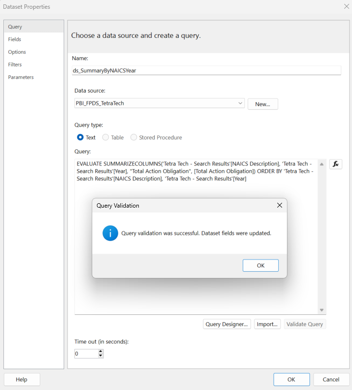

- Click OK and OK

### 2.7 Save the report

- Save the report as an .rdl file

## Part 3 - Create the report layout

### 3.1 Add a title placeholder in the header

- Use Insert → Header → Add Header to add a new header
- Move the existing title textbox into the header and apply a meaningful value (e.g., FPDS - Tetra Tech)


### 3.2 Add a table for detail display

- Click Insert → Table → Table Wizard
- Choose ds_Details and click Next
- From Available fields drag the following to Values (in the order prescribed):
  - Contract_ID
  - Date_Signed
  - Legal_Business_Name
  - Entity_State
  - NAICS_Description
  - PSC_Description
  - Action_Obligation


- Click Next
- Click Next
- Click Finish
- Position and size the table
- Experiment with formatting
- Add page numbers to the footer
- Click run, select a value for state, and select a value for NAICS
- Click View Report

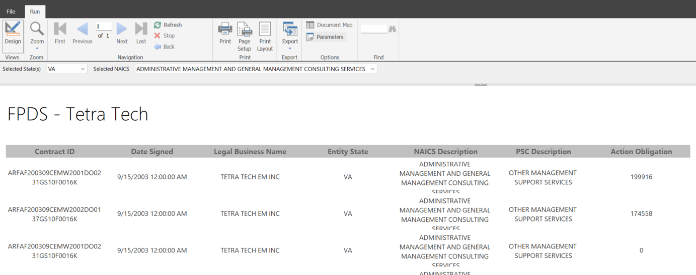

### 3.3 Adjust formatting and display

- Click Design
- Experiment with column and row sizing
- Click [Date_Signed]
- Under Number, click the dropdown next to Format, and click <Expression...>
- Use `=FormatDateTime(Fields!Date_Signed.Value, DateFormat.ShortDate)` for the expression
- Rerun the report
- Click Design
- Adjust the formatting expression for [Date_Signed] and use `=Format(Fields!Date_Signed.Value, "yyyy-MM-dd")` instead
- Rerun the report
- Click Design
- Click [Action_Obligation]
- On the Home menu, in the Number section, select Currency from the dropdown
- Under Font, click Color, and click Expression
- Use `=IIF(Fields!Action_Obligation.Value < 0, "Red", "Black")` for the expression
- Rerun the report

### 3.4 Add multi-select to parameters

- Click Design to return to report design mode
- In the Report Data pane under Parameters, right-click the State parameter and click Parameter Properties
- On the General tab, check Allow multiple values:

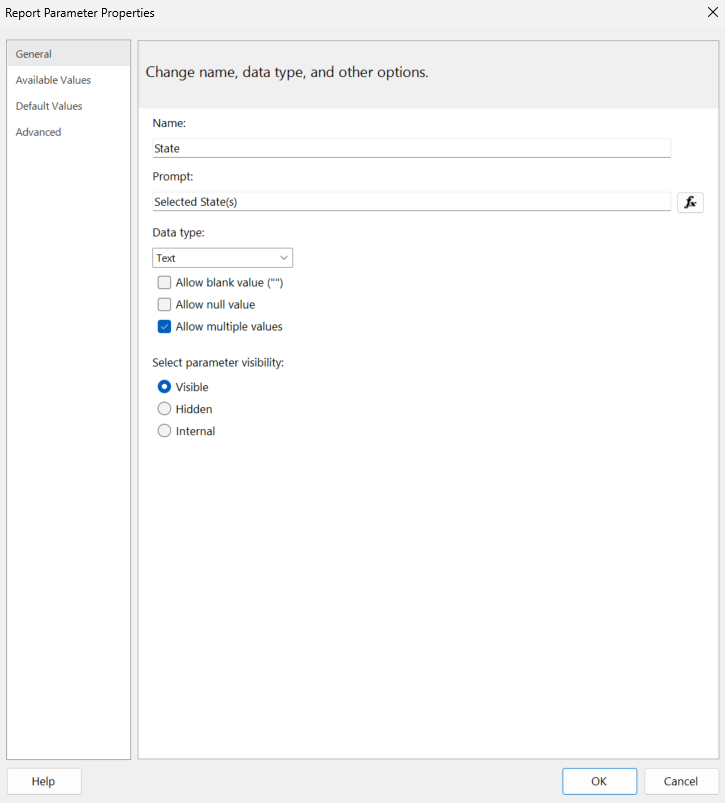

- On the default values tab, set the following properties:

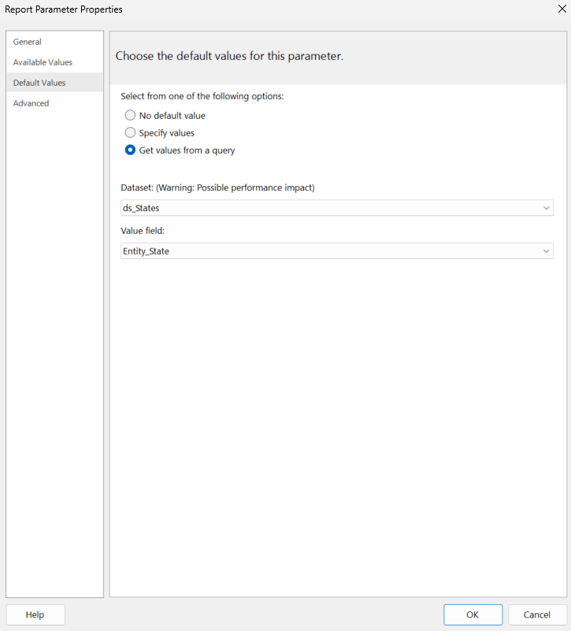

- Click OK
- In the Report Data pane under Parameters, right-click the NAICS parameter and click Parameter Properties
- On the General tab, check Allow multiple values:

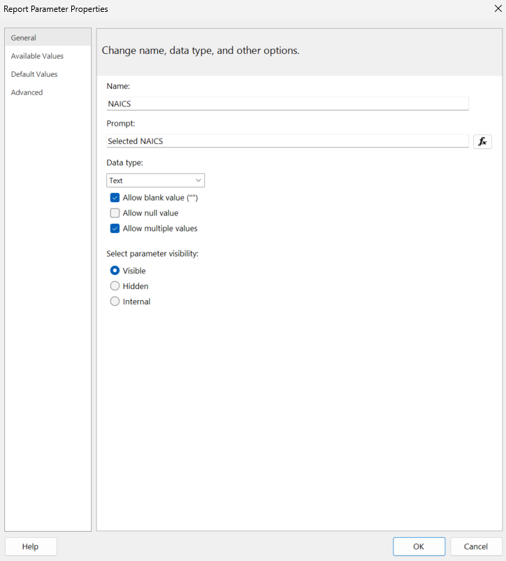

- On the default values tab, set the following properties:

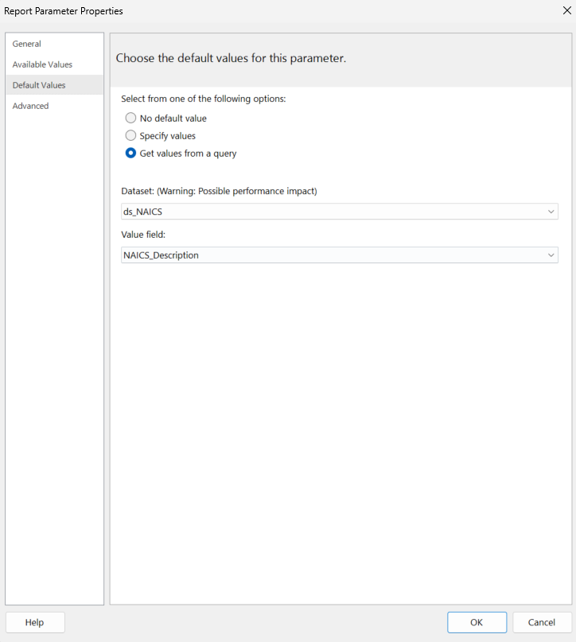

- Click OK
- In the Report Data pane under Datasets, right-click the ds_Details dataset and Dataset Properties
- Click Filters and change the Operator in each filter from = to In

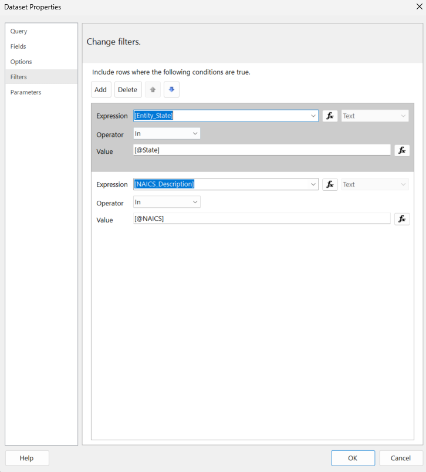

- Click OK
- Rerun the report

### 3.X Save the report

- Save the report as an .rdl file
