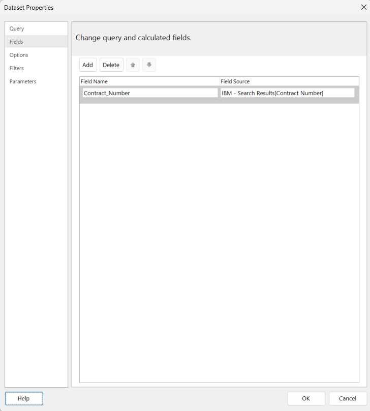
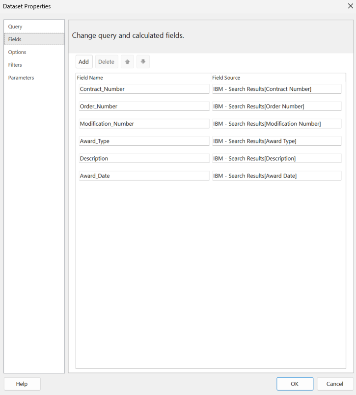
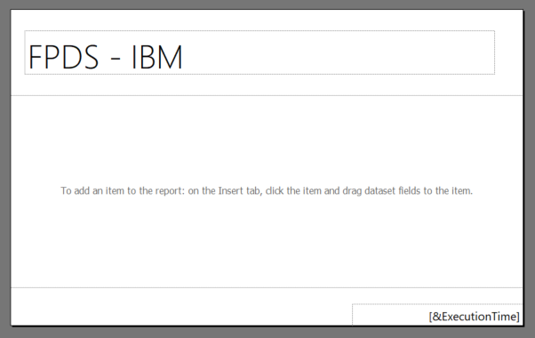

# Lab 01 - Data Sources & Datasets

## Overview

In this lab, you’ll use Power BI Report Builder to connect to a Power BI semantic model (dataset) that’s built from a CSV exported from FPDS. You’ll create a shared data source, build multiple datasets (including parameterized and lookup datasets), then build a table for display of the results. This report will give the user options for interacting with the data for filtering and sorting purposes.

## Learning objectives

By the end, you can:

- Explain the difference between Data Source and Dataset in paginated reports.
- Connect a paginated report to a Power BI dataset.
- Build summary and detail datasets, plus lookup datasets for parameters.
- Add parameters and wire them to datasets.
- Display data in a table in a paginated report.

## What you need

- Power BI Desktop (latest)
- Power BI Report Builder (latest)
- A Power BI workspace you can publish to
- File: IBM - Search Results.csv

## Part 1 - Build the semantic model in Power BI Desktop

### 1.1 Import the CSV

- Open Power BI Desktop
- Create a blank report → Get data → Text/CSV → choose IBM - Search Results.csv → Transform Data
- Remove all columns except for:
  - Contract ID → Rename to Contract Number
  - Reference IDV → Rename to Order Number
  - Modification Number
  - Award/IDV Type → Rename to Award Type
  - PSC Description → Rename to Description
  - Date Signed → Rename to Award Date
- Verify that data type for Award Date is set to Date
- Data types for all other columns should be Text
- For Modification Number, replace 0's with ORIG
- Click Close & Apply

### 1.2 Publish the model

- File → Save (e.g., FPDS_IBM.pbix)
- Home → Publish → login to the Power BI Service (if required)
- Create a new workspace (in Power BI Service) or select an existing workspace with access
- Confirm in the Power BI Service that the semantic model is present

## Part 2 - Connect Report Builder to the Power BI semantic model

### 2.1 Create the shared Data Source

- Open Power BI Report Builder and choose Blank Report
- In the Report Data pane, right‑click Data Sources and choose Add Power BI semantic model connection...; sign in if prompted
- Select your workspace, select the dataset/semantic model you published, and click Select


- Optional: rename the data source

### 2.2 Create lookup Datasets for parameter dropdowns

- In the Report Data pane, right‑click Datasets, and click Add Dataset
- Name the dataset something like ds_ContractNumbers
- Choose your data source from the dropdown
- For Query, use the following:

```DAX
EVALUATE SUMMARIZECOLUMNS('IBM - Search Results'[Contract Number]) ORDER BY 'IBM - Search Results'[Contract Number]
```

- Navigate to Fields and verify all field names



- Click Query and click Validate Query (to confirm no errors)


- Click OK and OK
- Repeat that same set of steps for Order Number, Modification Number, Award Type, Description, and Award Date

### 2.3 Create report parameters for each filter attribute

- In the Report Data pane, right-click Parameters, and click Add Parameter...
- On the General tab, for Name use ContractNumber and for Prompt use Selected Contract Number; check Allow multiple values


- On the Available Values tab, set the following:


- On the Default Values tab, set the following:


- Click OK
- Repeat that same set of steps for Order Number, Modification Number, Award Type, Description, and Award Date

### 2.4 Create a parameterized detail Dataset

- In the Report Data pane, right‑click Datasets, and click Add Dataset
- Name the dataset something like ds_Details
- Choose your data source from the dropdown
- For Query, use the following:

```DAX
EVALUATE SUMMARIZECOLUMNS('IBM - Search Results'[Contract Number], 'IBM - Search Results'[Order Number], 'IBM - Search Results'[Modification Number], 'IBM - Search Results'[Award Type], 'IBM - Search Results'[Description], 'IBM - Search Results'[Award Date])
```

- Navigate to Fields and verify all field names



- Click Filters and specify the following filters:


- Click Query
- In the resulting Query, add ```ORDER BY 'IBM - Search Results'[Award Date]``` to the end of the query
- Click Validate Query (to confirm no errors)


- Click OK and OK

### 2.5 Save the report

- Save the report as an .rdl file

## Part 3 - Create the report layout

### 3.1 Add a title placeholder in the header

- Use Insert → Header → Add Header to add a new header
- Move the existing title textbox into the header and apply a meaningful value (e.g., FPDS - IBM)



### 3.2 Add a table for detail display

- Click Insert → Table → Table Wizard
- Choose ds_Details and click Next
- From Available fields drag the following to Values (in the order prescribed):
  - Contract_Number
  - Order_Number
  - Modification_Number
  - Award_Type
  - Description
  - Award_Date


- Click Next
- Click Next
- Click Finish
- Position and size the table and center data display

### 3.3 Add interactive sorting to Award Date

- Right-click the Award Date header and click Text Box Properties...


- On the Interactive Sorting tab, check Enable interactive sorting on this text box
- Under Choose what to sort, make sure Detail rows is selected
- In the Sort by dropdown, select [Award_Date]


- Click OK
- Click run and notice that all parameter dropdowns have all options selected except for Selected Order Number and Selected Description - any ideas why and how to fix?
- HINT: it has to do with blank values in those dropdowns...
- After correcting, experiment with the different parameters; click View Report to see the results

### 3.4 Save the report

- Save the report as an .rdl file
