# Lab 02 - Data Sources & Datasets

## Overview

In this lab, you’ll use Power BI Report Builder to connect to a Power BI semantic model (dataset) that’s built from a CSV exported from FPDS. You’ll create a shared data source, build multiple datasets (including parameterized and lookup datasets), then do a quick layout smoke test by adding a table and a matrix with no formatting.

## Learning objectives

By the end, you can:

- Explain the difference between Data Source and Dataset in paginated reports.
- Connect a paginated report to a Power BI dataset.
- Build summary and detail datasets, plus lookup datasets for parameters.
- Add parameters and wire them to datasets.
- Validate the datasets end‑to‑end with a simple table and matrix.

## What you need

- Power BI Desktop (latest)
- Power BI Report Builder (latest)
- A Power BI workspace you can publish to
- File: Tetra Tech - Search Results.csv

## Part 1 - Build the semantic model in Power BI Desktop

### 1.1 Import the CSV

- Open Power BI Desktop
- Create a blank report → Get data → Text/CSV → choose Tetra Tech - Search Results.csv → Transform Data
- Remove all columns except for:
  - Contract ID
  - Action Obligation ($)
  - Date Signed
  - PSC Description
  - NAICS Description
  - Entity State
  - Legal Business Name
- Rename Action Obligation ($) to Action Obligation
- Verify that data type for Action Obligation is set to Fixed decimal number
- Verify that data type for Date Signed is set to Date
- Data types for all other columns should be Text
- Add Year Signed:
  - Select Date Signed
  - Add Column → Date → Year
  - Rename to Year Signed
- Click Close & Apply

### 1.2 Create a basic measure

Click Modeling → New measure and use the following DAX definition:

```DAX
Total Action Obligation = SUM('Tetra Tech - Search Results'[Action Obligation])
```

### 1.3 Publish the model

- File → Save (e.g., FPDS_TetraTech.pbix)
- Home → Publish → login to the Power BI Service (if required)
- Create a new workspace (in Power BI Service) or select an existing workspace with access
- Confirm in the Power BI Service that the semantic model is present

### 1.4 Save the report

- Save the report as an .rdl file

## Part 2 - Connect Report Builder to the Power BI semantic model

### 2.1 Create the shared Data Source

- Open Power BI Report Builder and choose Blank Report
- In the Report Data pane, right‑click Data Sources and choose Add Power BI semantic model connection...; sign in if prompted
- Select your workspace, select the dataset/semantic model you published, and click Select

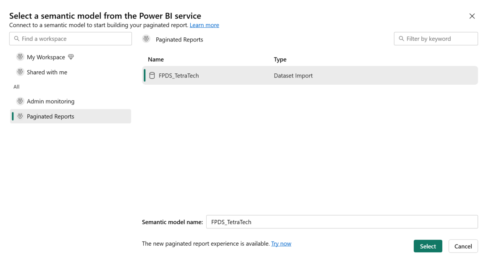

- Optional: rename the data source

### 2.2 Create a summary Dataset (by NAICS)

- In the Report Data pane, right‑click Datasets, and click Add Dataset
- Name the dataset something like ds_SummaryByNAICS
- Choose your data source from the dropdown and click Query Designer
- Drag the NAICS Description field and the Total Action Obligation measure into the dataset definition
- Execute the query to verify results

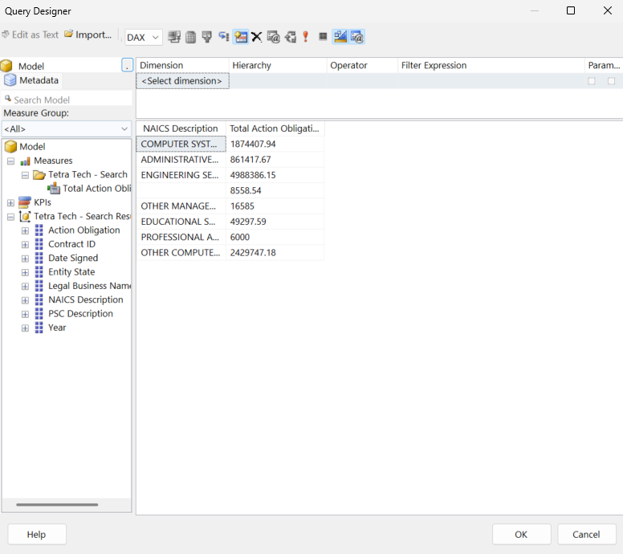

- Click OK
- In the resulting Query, add ```ORDER BY 'Tetra Tech - Search Results'[NAICS Description]``` to the end of the query
- Click Validate Query (to confirm no errors)

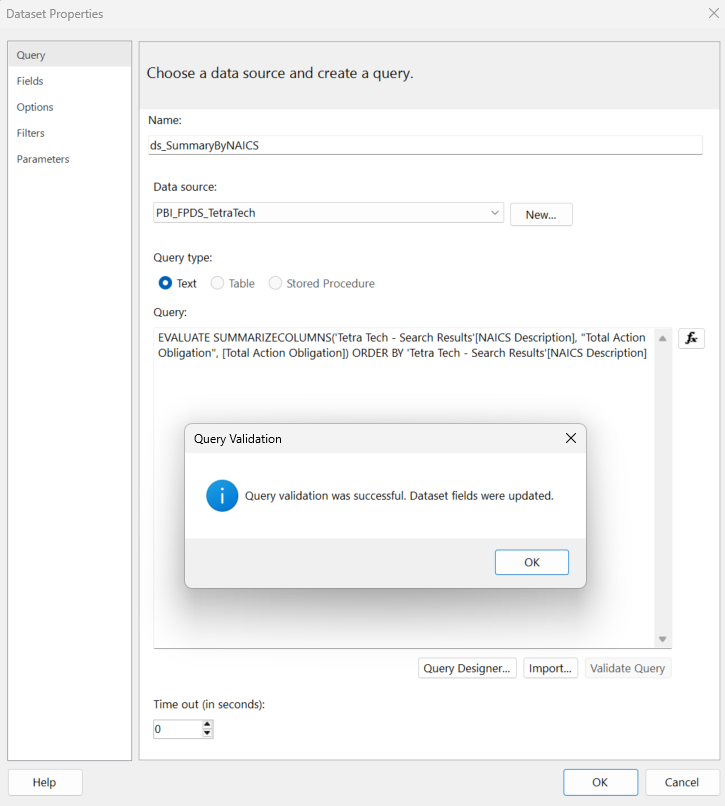

- Click OK and OK

### 2.3 Create lookup Datasets for parameter dropdowns

- In the Report Data pane, right‑click Datasets, and click Add Dataset
- Name the dataset something like ds_States
- Choose your data source from the dropdown
- For Query, use the following:

```DAX
EVALUATE SUMMARIZECOLUMNS('Tetra Tech - Search Results'[Entity State]) ORDER BY 'Tetra Tech - Search Results'[Entity State]
```

- Navigate to Fields and verify all field names

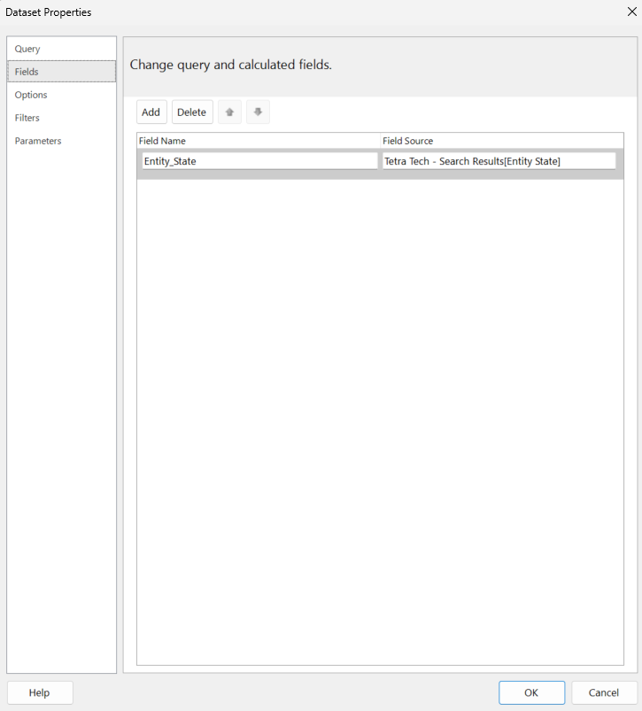

- Click Query and click Validate Query (to confirm no errors)

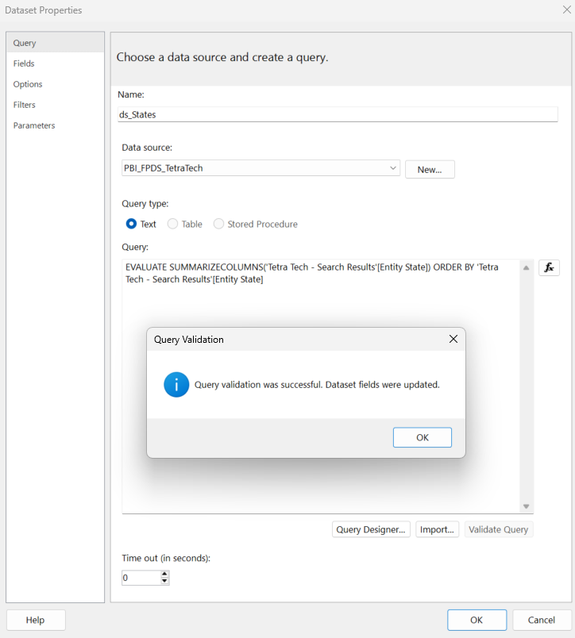

- Click OK and OK
- In the Report Data pane, right‑click Datasets, and click Add Dataset
- Name the dataset something like ds_NAICS
- Choose your data source from the dropdown
- For Query, use the following:

```DAX
EVALUATE SUMMARIZECOLUMNS('Tetra Tech - Search Results'[NAICS Description]) ORDER BY 'Tetra Tech - Search Results'[NAICS Description]
```

- Navigate to Fields and verify all field names

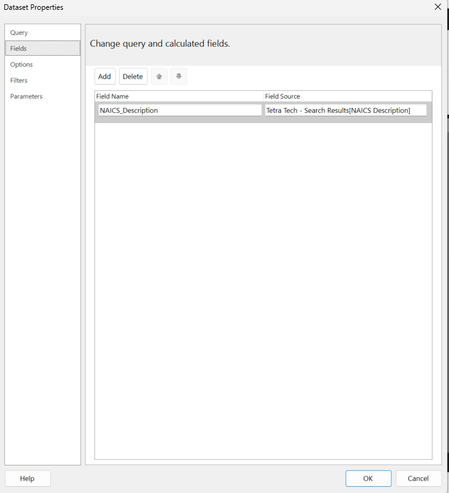

- Click Query and click Validate Query (to confirm no errors)

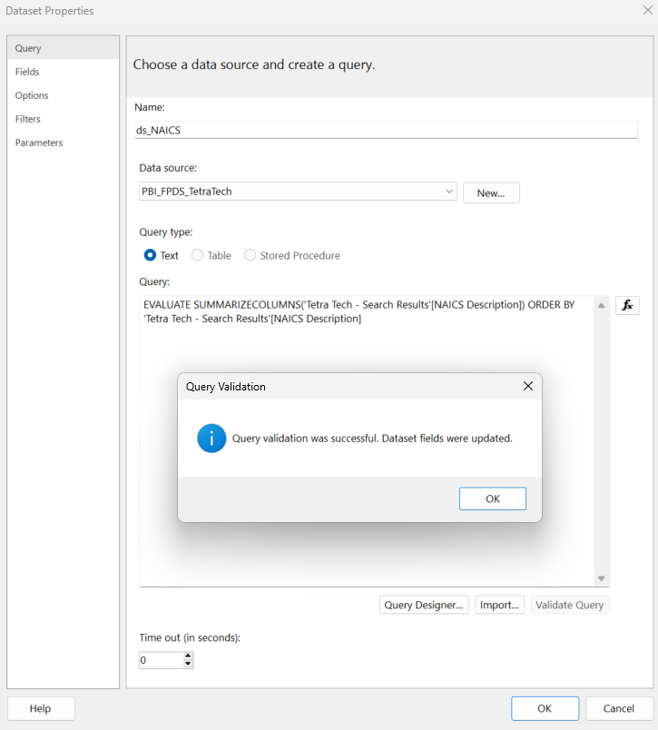

- Click OK and OK

### 2.4 Create parameters for State and NAICS

- In the Report Data pane, right-click Parameters, and click Add Parameter...
- On the General tab, for Name use State and for Prompt use Selected State(s)

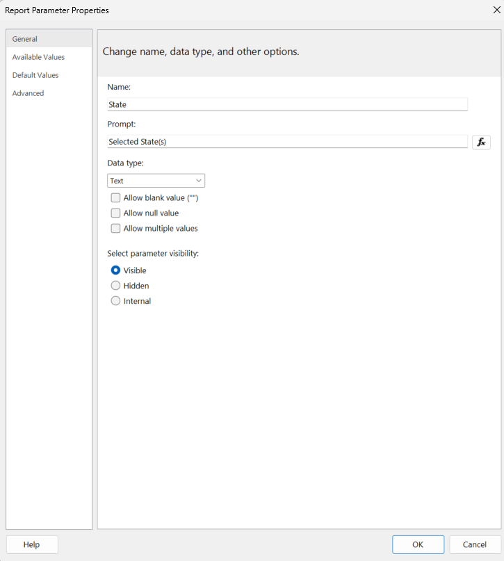

- On the Available Values tab, set the following:

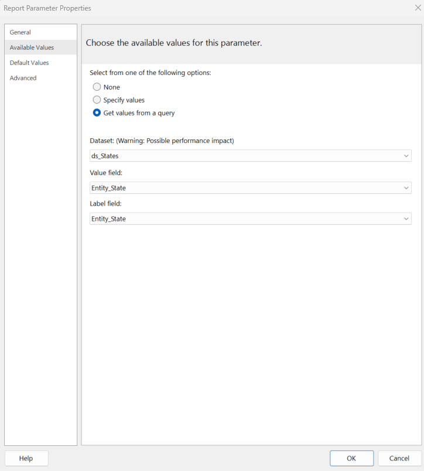

- Click OK
- In the Report Data pane, right-click Parameters, and click Add Parameter...
- On the General tab, for Name use NAICS and for Prompt use Selected NAICS
- Check Allow blank value (""):

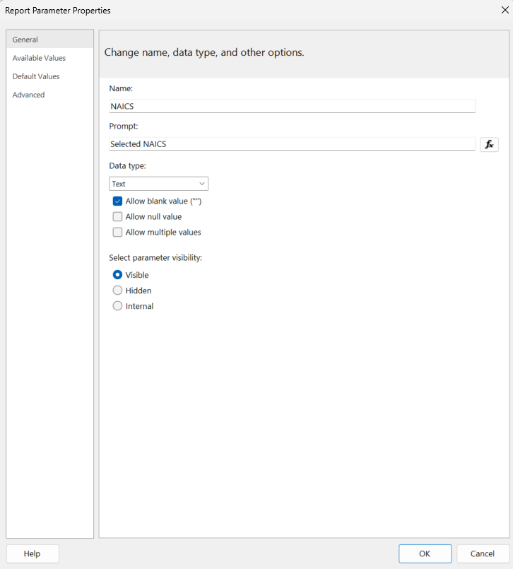

- On the Available Values tab, set the following:

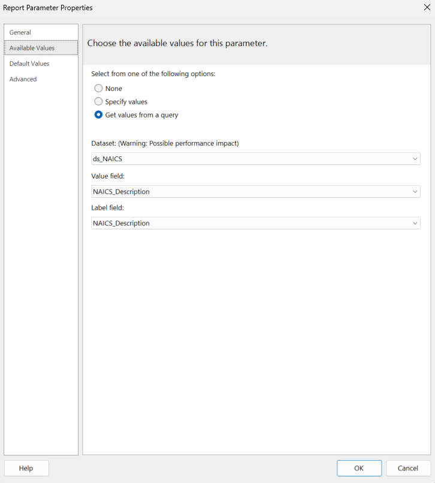

- Click OK

### 2.5 Create a parameterized detail Dataset

- In the Report Data pane, right‑click Datasets, and click Add Dataset
- Name the dataset something like ds_Details
- Choose your data source from the dropdown
- For Query, use the following:

```DAX
EVALUATE SUMMARIZECOLUMNS('Tetra Tech - Search Results'[Contract ID], 'Tetra Tech - Search Results'[Date Signed], 'Tetra Tech - Search Results'[Legal Business Name], 'Tetra Tech - Search Results'[NAICS Description], 'Tetra Tech - Search Results'[PSC Description], 'Tetra Tech - Search Results'[Entity State], 'Tetra Tech - Search Results'[Action Obligation])
```

- Navigate to Fields and verify all field names

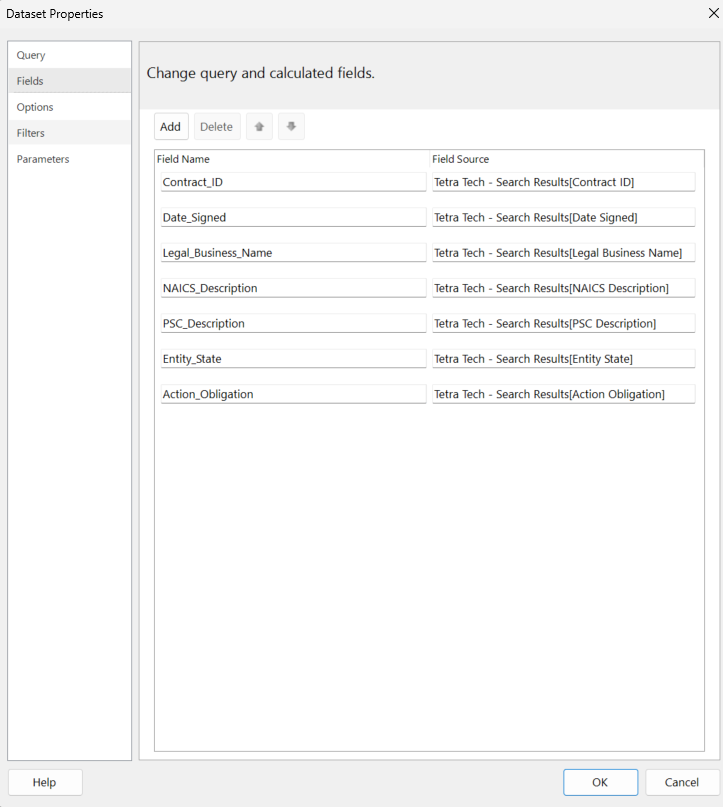

- Click Filters and specify the following filters:

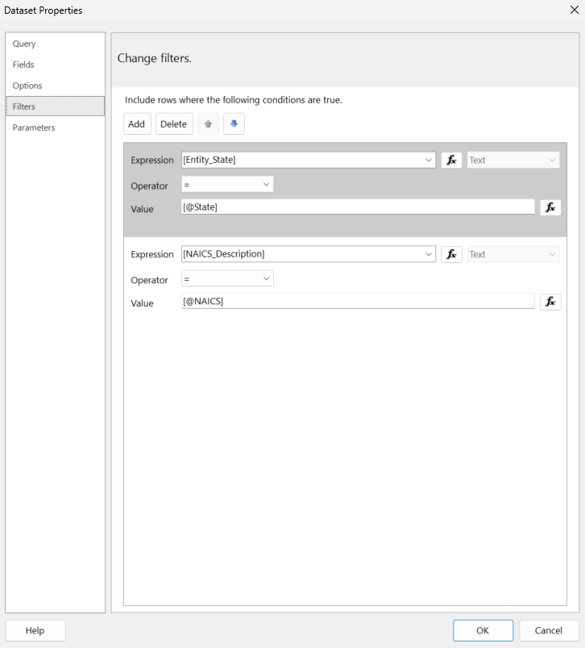

- Click Query
- In the resulting Query, add ```ORDER BY 'Tetra Tech - Search Results'[Date Signed]``` to the end of the query
- Click Validate Query (to confirm no errors)


- Click OK and OK

### 2.6 Add a second summary Dataset for a matrix

- In the Report Data pane, right‑click Datasets, and click Add Dataset
- Name the dataset something like ds_SummaryByNAICSYear
- Choose your data source from the dropdown and click Query Designer
- Drag the NAICS Description field, the Year field, and the Total Action Obligation measure into the dataset definition
- Execute the query to verify results

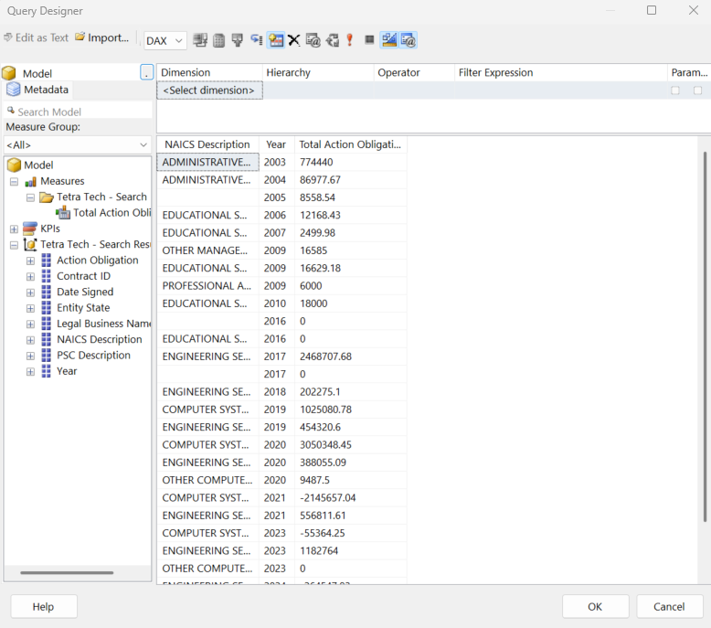

- Click OK
- In the resulting Query, add ```ORDER BY 'Tetra Tech - Search Results'[NAICS Description], 'Tetra Tech - Search Results'[Year]``` to the end of the query
- Click Validate Query (to confirm no errors)

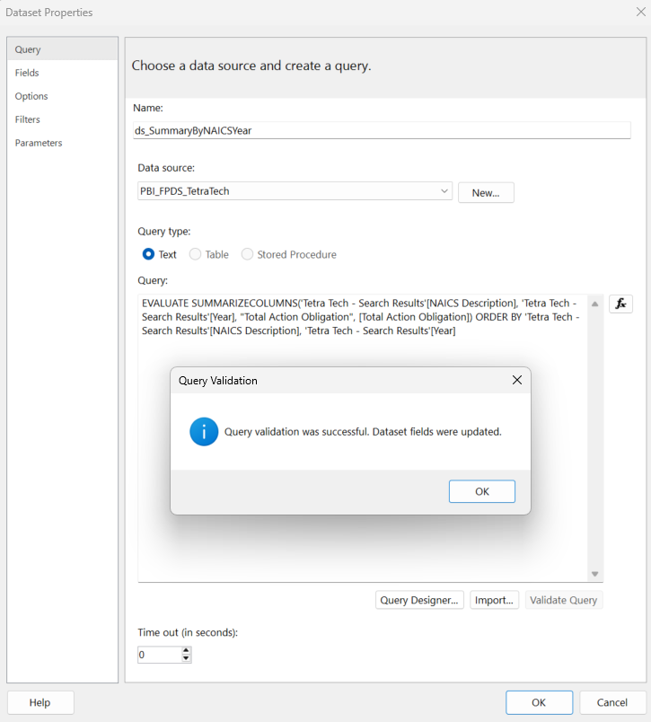

- Click OK and OK

### 2.7 Save the report

- Save the report as an .rdl file

## Part 3 - Create the report layout

### 3.1 Add a title placeholder in the header

- Use Insert → Header → Add Header to add a new header
- Move the existing title textbox into the header and apply a meaningful value (e.g., FPDS - Tetra Tech)

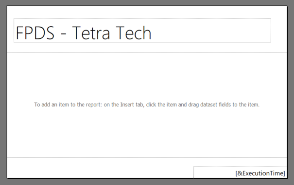

### 3.2 Add a table for detail display

- Click Insert → Table → Table Wizard
- Choose ds_Details and click Next
- From Available fields drag the following to Values (in the order prescribed):
  - Contract_ID
  - Date_Signed
  - Legal_Business_Name
  - Entity_State
  - NAICS_Description
  - PSC_Description
  - Action_Obligation

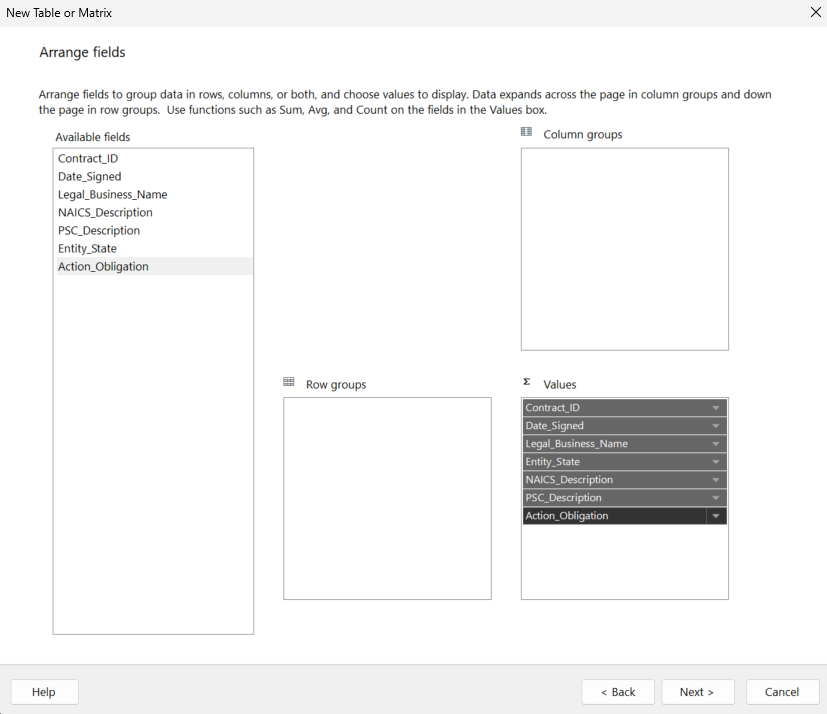

- Click Next
- Click Next
- Click Finish
- Position and size the table
- Experiment with formatting
- Add page numbers to the footer
- Click run, select a value for state, and select a value for NAICS
- Click View Report


### 3.3 Adjust formatting and display

- Click Design
- Experiment with column and row sizing
- Click [Date_Signed]
- Under Number, click the dropdown next to Format, and click <Expression...>
- Use `=FormatDateTime(Fields!Date_Signed.Value, DateFormat.ShortDate)` for the expression
- Rerun the report
- Click Design
- Adjust the formatting expression for [Date_Signed] and use `=Format(Fields!Date_Signed.Value, "yyyy-MM-dd")` instead
- Rerun the report
- Click Design
- Click [Action_Obligation]
- On the Home menu, in the Number section, select Currency from the dropdown
- Under Font, click Color, and click Expression
- Use `=IIF(Fields!Action_Obligation.Value < 0, "Red", "Black")` for the expression
- Rerun the report

### 3.4 Add multi-select to parameters

- Click Design to return to report design mode
- In the Report Data pane under Parameters, right-click the State parameter and click Parameter Properties
- On the General tab, check Allow multiple values:

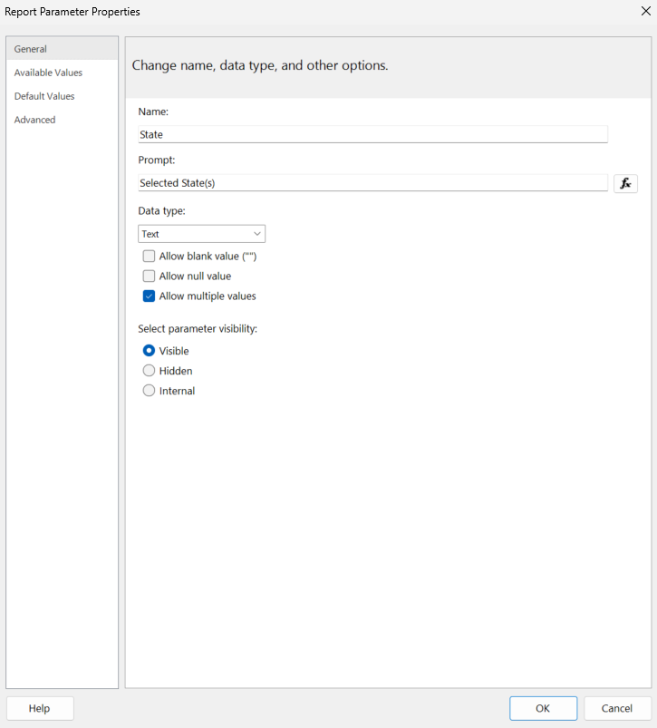

- On the default values tab, set the following properties:

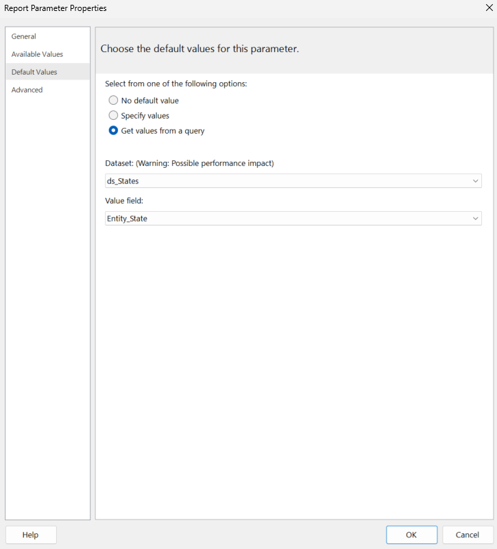

- Click OK
- In the Report Data pane under Parameters, right-click the NAICS parameter and click Parameter Properties
- On the General tab, check Allow multiple values:

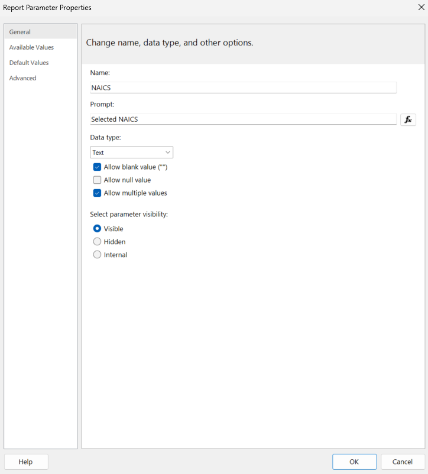

- On the default values tab, set the following properties:

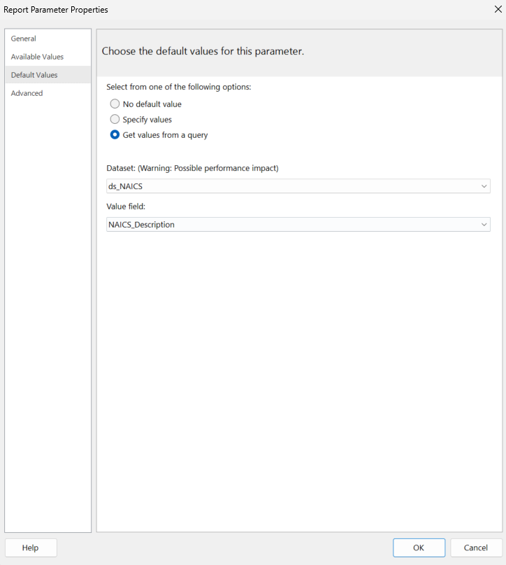

- Click OK
- In the Report Data pane under Datasets, right-click the ds_Details dataset and Dataset Properties
- Click Filters and change the Operator in each filter from = to In

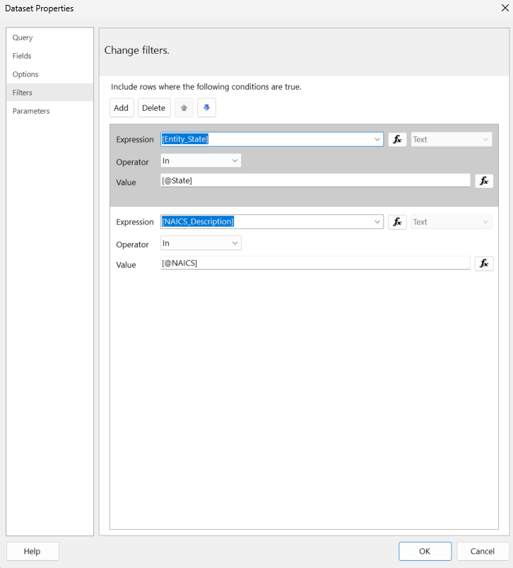

- Click OK
- Rerun the report

### 3.5 Save the report

- Save the report as an .rdl file

## Part 4 - Additional report modifications

### 4.1 Manage and summarize data

Some of the records have a blank value for NAICS Description - that may be the desired value for use in the report. However, in some cases, for reporting purposes, it may be advantageous to replace that value with something different. This section will discuss two options for doing so.

Option 1

- Click Design to return to report design mode
- In the Report Data pane under Datasets, right-click the ds_Details dataset and Dataset Properties
- Replace the existing query with the following:

```DAX
EVALUATE
VAR _base =
    SUMMARIZECOLUMNS(
        'Tetra Tech - Search Results'[Contract ID],
        'Tetra Tech - Search Results'[Date Signed],
        'Tetra Tech - Search Results'[Legal Business Name],
        'Tetra Tech - Search Results'[NAICS Description],
        'Tetra Tech - Search Results'[PSC Description],
        'Tetra Tech - Search Results'[Entity State],
        'Tetra Tech - Search Results'[Action Obligation]
    )
RETURN
SELECTCOLUMNS(
    _base,
    "Contract ID", [Contract ID],
    "Date Signed", [Date Signed],
    "Legal Business Name", [Legal Business Name],
    "NAICS Description",
        IF(
            ISBLANK([NAICS Description]) || TRIM([NAICS Description]) = "",
            "Unknown",
            [NAICS Description]
        ),
    "PSC Description", [PSC Description],
    "Entity State", [Entity State],
    "Action Obligation", [Action Obligation]
)
ORDER BY [Date Signed]
```

- Verify field names from Fields tab
- Click Validate Query (to confirm no errors)


- Click OK and OK
- In the Report Data pane under Datasets, right-click the ds_NAICS dataset and Dataset Properties
- Replace the existing query with the following:

```DAX
EVALUATE
VAR _base =
    SUMMARIZECOLUMNS(
        'Tetra Tech - Search Results'[NAICS Description]
    )
RETURN
SELECTCOLUMNS(
    _base,
    "NAICS Description",
        IF(
            ISBLANK([NAICS Description]) || TRIM([NAICS Description]) = "",
            "Unknown",
            [NAICS Description]
        )
)
ORDER BY [NAICS Description]
```

- Verify field names from Fields tab
- Click Validate Query (to confirm no errors)

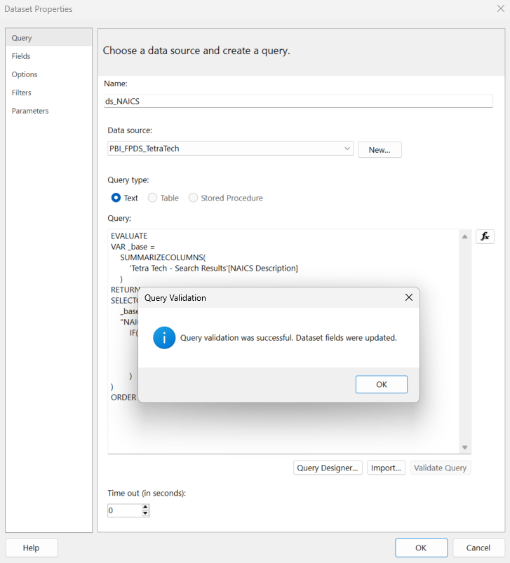

- Click OK and OK
- Rerun the report

Option 2

- Click Design to return to report design mode
- In the Report Data pane under Datasets, right-click the ds_Details dataset and Dataset Properties
- Restore the query to its original value:

```DAX
EVALUATE SUMMARIZECOLUMNS('Tetra Tech - Search Results'[Contract ID], 'Tetra Tech - Search Results'[Date Signed], 'Tetra Tech - Search Results'[Legal Business Name], 'Tetra Tech - Search Results'[NAICS Description], 'Tetra Tech - Search Results'[PSC Description], 'Tetra Tech - Search Results'[Entity State], 'Tetra Tech - Search Results'[Action Obligation]) ORDER BY 'Tetra Tech - Search Results'[Date Signed]
```

- Verify field names from Fields tab
- Click Validate Query (to confirm no errors)
- Click OK and OK
- In the Report Data pane under Datasets, right-click the ds_NAICS dataset and Dataset Properties
- Restore the query to its original value:

```DAX
EVALUATE SUMMARIZECOLUMNS('Tetra Tech - Search Results'[NAICS Description]) ORDER BY 'Tetra Tech - Search Results'[NAICS Description]
```

- Verify field names from Fields tab
- Click Validate Query (to confirm no errors)
- Click OK and OK
- Navigate to the semantic model (the .pbix file) in Power BI Desktop
- Click Transform Data
- Add a Replace Values... transformation for NAICS Description
- Click Close & Apply
- Publish the updated model to the Power BI Service
- In Power BI Report Builder you may need to save, close, and reopen the .rdl file
- Rerun the report

### 4.2 Summarize data by NAICS description

- Click Design to return to report design mode
- Right-click a cell in the Tablix (e.g., NAICS Description) and select Add Group and Parent Group under Row Group

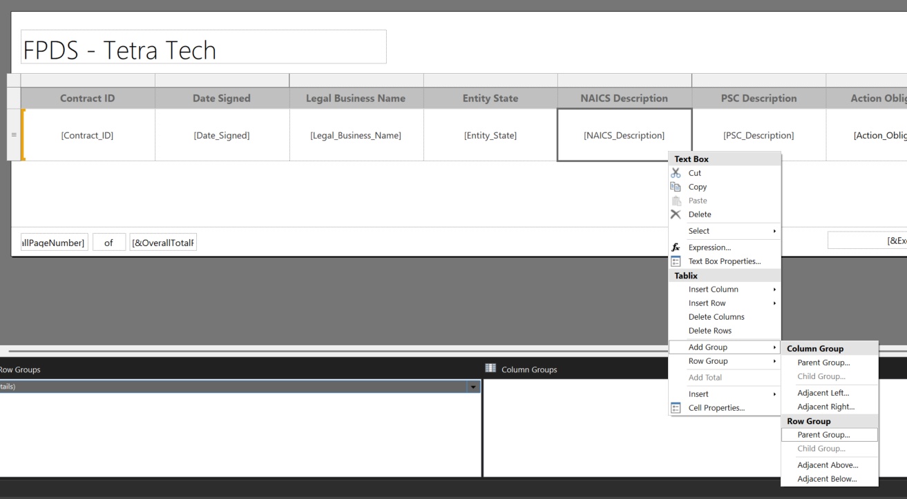

- Select NAICS Description for Group by value
- Click Add group footer

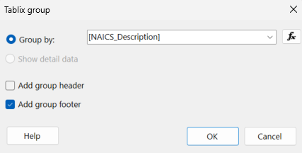

- Click OK
- Optional: Click on the NAICS Description group by cell and change the Name property (e.g., change from NAICS_Description1 to NAICS_Desc)

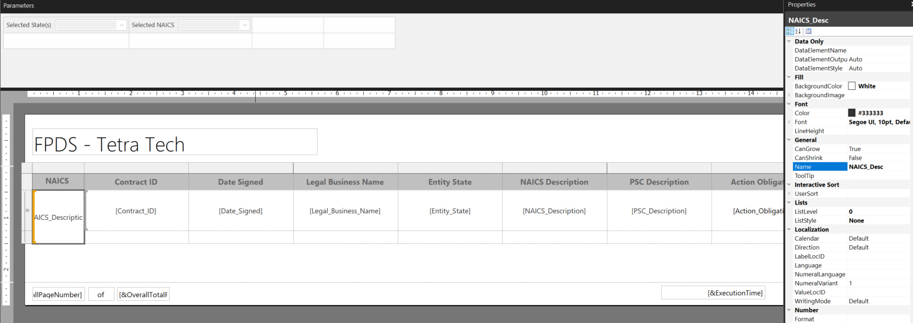

- Click the top row of the two in the group, right-click, and select Row Properties...

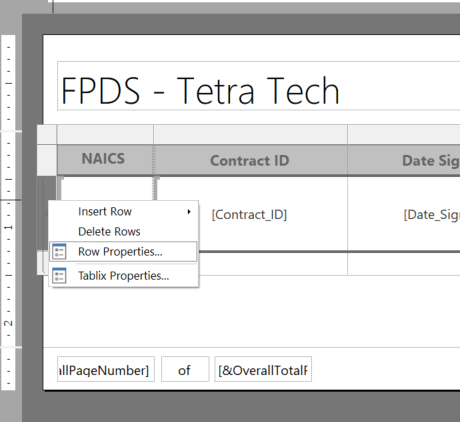

- On the Visibility tab, choose Hide under When the report is initially run
- Check Display can be toggled by this report item and select the name assigned to the group by

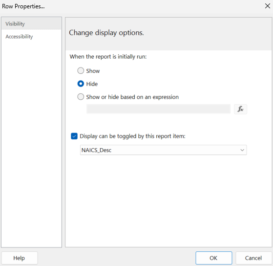

- Click OK
- Optional: Remove column heading for group by column
- Optional: Change vertical alignment for group by column value
- Optional: Resize the group by column
- In the cell below the current Action Obligation value, set the value to [Sum(Action_Obligation)]
- Change number format to Currency
- Experiment with the formatting (e.g., right justify dollar amounts, add bolding, add shading to make it easier for a user to read the report, and add grid lines)
- Rerun the report
- Click Design to return to report design mode
- Click the View menu and verify that Grouping is checked
- In the Row Groups area, click the dropdown arrow next to NAICS_Description, select Add Total, and click After

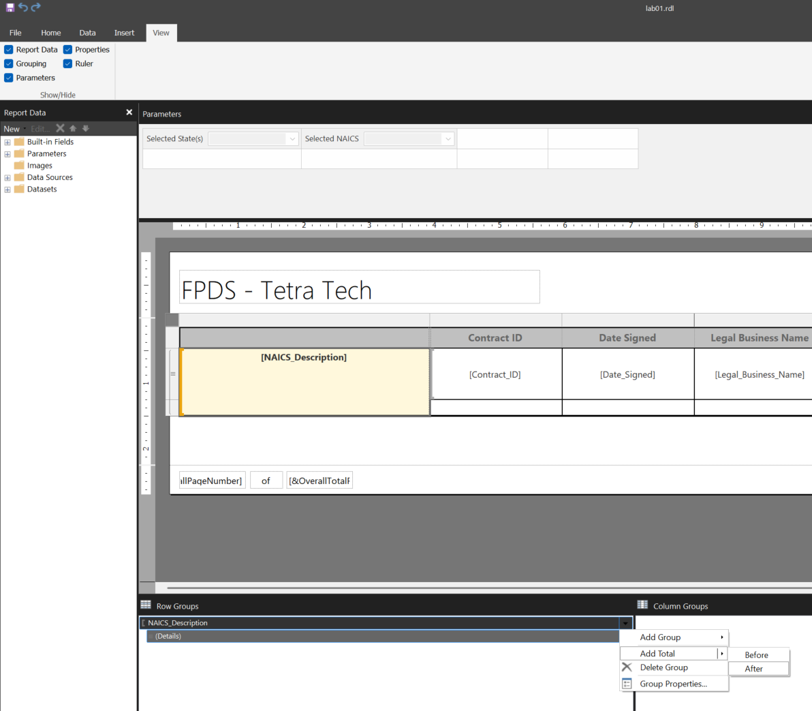

- In the new Total row in the Action Obligation column, set the value to [Sum(Action_Obligation)]
- Change number format to Currency

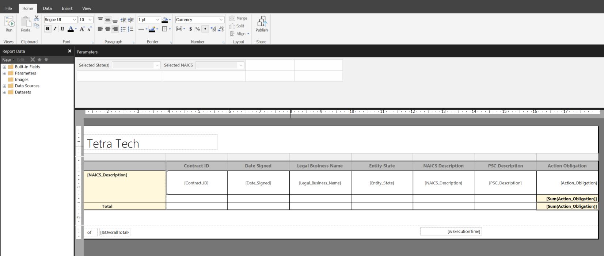

### 4.3 Save the report

- Save the report as an .rdl file

## Part 5 - Managing sorting and exporting

### 5.1 Add an Expand All parameter

- Click Design to return to report design mode
- In the Report Data pane, right-click Parameters and click Add Parameter...
- Set the General tab properties as follows:

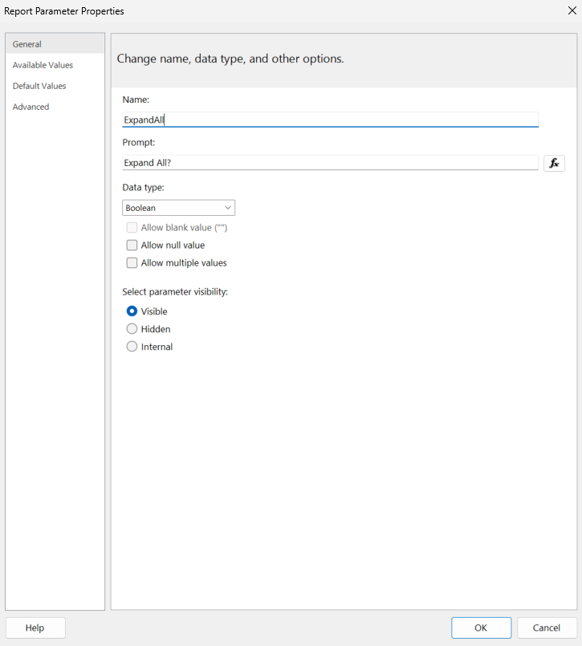

- Navigate to the Available Values tab and set the properties as follows:

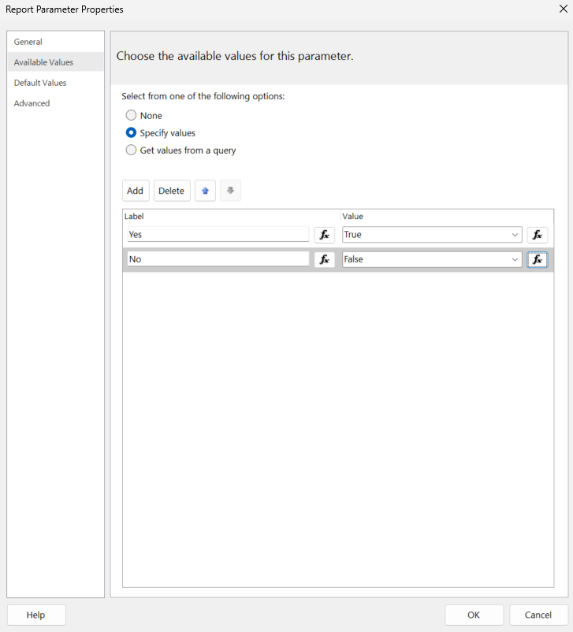

- Navigate to the Default Values tab and set the properties as follows:

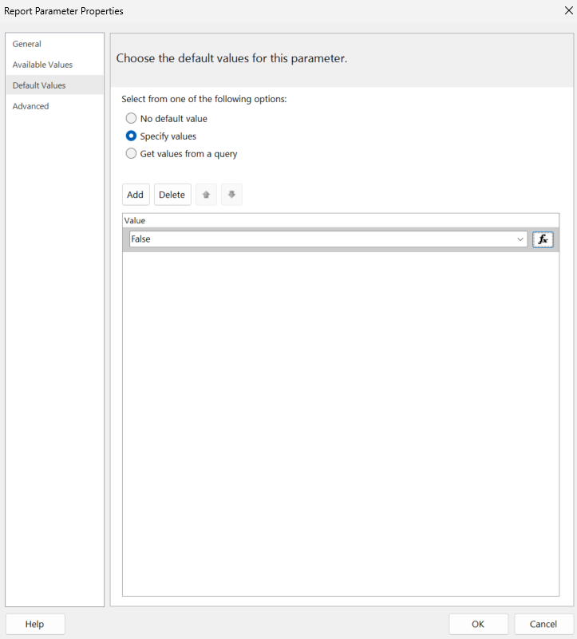

- Click OK
- Right-click the group row and select Row Properties...

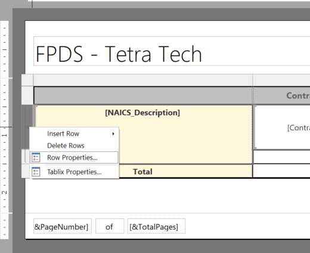

- On the Visibility tab, select Show or hide based on an expression and use the following expression:

``` DAX
=IIF(Globals!RenderFormat.IsInteractive, NOT Parameters!ExpandAll.Value, False)
```

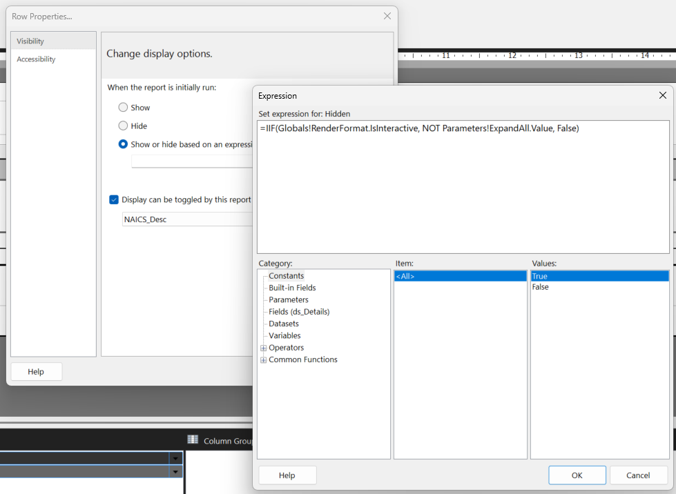

- Click OK and OK
- Rerun the report
- Experiment with the Expand All parameter - View Report will need to be executed on each change to the parameter value to reflect the selection

### 5.2 Add sorting to Action Obligation

- Click Design to return to report design mode
- Right-click the Action Obligation column header and choose Text Box Properties...
- Click Interactive Sorting and set the properties as follows:

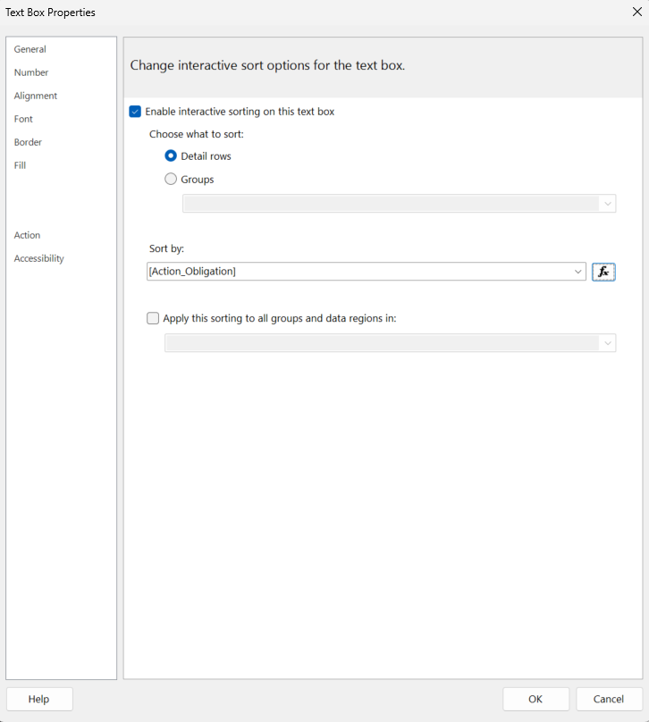

- Click OK
- Rerun the report
- Experiment with the sorting
- Notice that sorting only applies to the details (expanded view) based on assigned properties
- Alternatively, you could adjust the report to show expanded automatically, use True for expand all default, and apply sorting to the groups as well as the details

### 5.3 Format export/print view via Page Setup

- Rerun the report
- Click Page Setup and adjust the settings as follows:

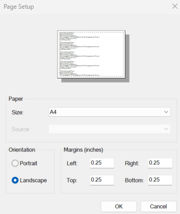

- You can experiment with Page Setup and Print Layout to find the ideal size
- You can print to PDF from here
- Also, you can export the document (though print format may be less than optimal depending on selected format)
- Note that when printing or exporting, all expandable groups are expanded (based on settings applied earlier)

### 5.4 Save the report

- Save the report as an .rdl file
